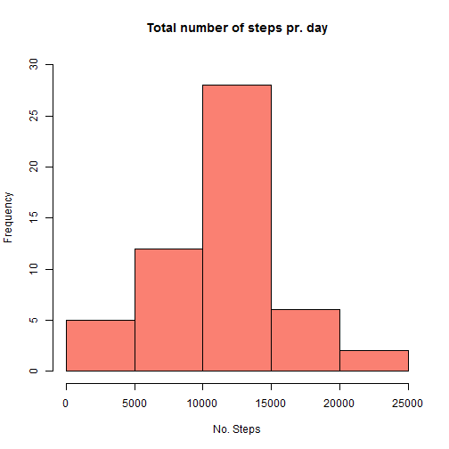
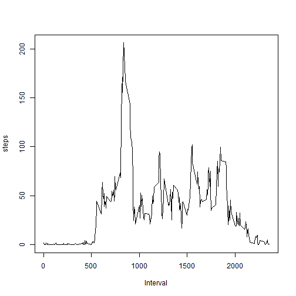
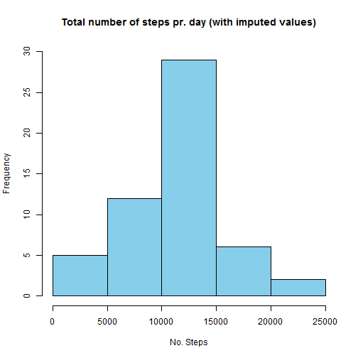
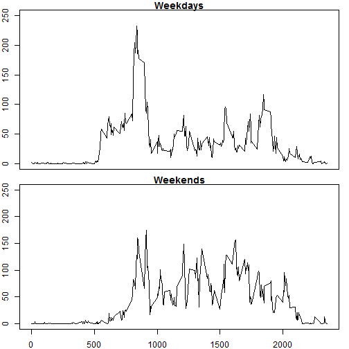

  
  ####1. Loading and preprocessing the data
  

```r
setwd("C:/Dropbox/R/Reprod1")
df <- read.csv("activity.csv")
```

####2. What is mean total number of steps taken per day?


```r
totalday <- aggregate(steps~date,df,sum) #Create a dataframe with total steps pr day
hist(totalday$steps,main = "Total number of steps pr. day",xlab="No. Steps",c="salmon",ylim=c(0,30)) #Create the histogram
```

 

```r
print(paste("Mean total number of steps pr day",mean(totalday$steps)))
```

```
## [1] "Mean total number of steps pr day 10766.1886792453"
```

```r
print(paste("Median total number of steps pr day",median(totalday$steps ))) 
```

```
## [1] "Median total number of steps pr day 10765"
```


####3. What is the average daily activity pattern?


```r
meaninterval <- aggregate(steps~interval,df,mean) #Create a dataframe with mean steps pr. interval
plot(meaninterval$interval,meaninterval$steps,type="l",ylab="steps",xlab="Interval")
```

 

```r
print(paste("Interval with maximum number of average steps:",meaninterval[which.max(meaninterval$steps),1]))  
```

```
## [1] "Interval with maximum number of average steps: 835"
```

####4. Imputing missing values  


```r
print(paste("Number of missing values for date variable:", sum(is.na(df$date))))
```

```
## [1] "Number of missing values for date variable: 0"
```

```r
print(paste("Number of missing values for interval variable:", sum(is.na(df$interval))))
```

```
## [1] "Number of missing values for interval variable: 0"
```

```r
print(paste("Number of missing values for steps variable:", sum(is.na(df$steps))))
```

```
## [1] "Number of missing values for steps variable: 2304"
```

```r
#for imputing missing values for steps i am using the mean number of steps for the respective interval
#this is allready computed in step 3

dfimpute <-  df
for (i in 1:nrow(dfimpute))
  if (is.na(dfimpute[i,1]))
    dfimpute[i,1]=meaninterval[i,2]

#Create dataframe with total steps pr day with imputation
totalday.impute <- aggregate(steps~date,dfimpute,sum) 

#create the histogram, report mean and median
hist(totalday.impute$steps,main = "Total number of steps pr. day (with imputed values)",xlab="No. Steps",c="skyblue",ylim=c(0,30))
```

 

```r
print(paste("Mean total number of steps pr day (with imputed values)", mean(totalday.impute$steps)))
```

```
## [1] "Mean total number of steps pr day (with imputed values) 10766.1886792453"
```

```r
print(paste("Median total number of steps pr day (with imputed values)",median(totalday.impute$steps)))
```

```
## [1] "Median total number of steps pr day (with imputed values) 10765.5943396226"
```


Imputing has no effect on the mean (as we just add another day with the mean values of each interval to the set). Imputing marginally affects the median value. Imputing does not affect the data enough to alter the histogram significantly.


#### 5.Are there differences in activity patterns between weekdays and weekends?


```r
#Add weekday to set with imputed values
dfimpute$weekday <- weekdays(as.Date(dfimpute$date))
#split set in weekend and weekdays

dfimpute$daytype <- as.factor(ifelse(dfimpute$weekday %in% c("Saturday","Sunday"),"Weekend","Weekday"))
dfweekend <- dfimpute[dfimpute$daytype=="Weekend",]
dfweekday <- dfimpute[dfimpute$daytype=="Weekday",]


#Calculate mean values for intervals
meanweekend <- aggregate(steps~interval,dfweekend,mean)
meanweekday <- aggregate(steps~interval,dfweekday,mean)

#plot
par(mfrow=c(2,1),mar=c(0.5,2,1,1))
plot(meanweekday$interval,meanweekday$steps,type="l",ylab="steps",xlab="",main="Weekdays",xaxt="n",ylim=c(0,250))
par(mar=c(2,2,1,1))
plot(meanweekend$interval,meanweekend$steps,type="l",ylab="steps",xlab="Interval",main="Weekends",ylim=c(0,250))
```

 


